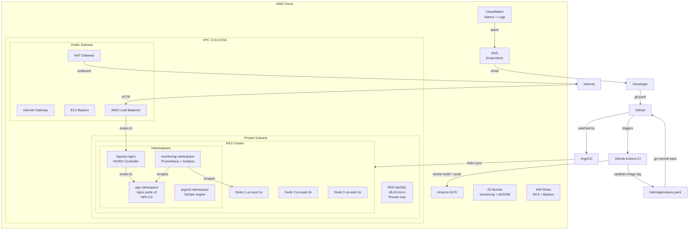

# Architecture Diagram

```mermaid
graph TB
    Dev[Developer] -->|git push| GH[GitHub]
    GH -->|triggers| GA[GitHub Actions CI]
    GA -->|docker build + push| ECR[Amazon ECR]
    GA -->|updates image tag| HV[helm/app/values.yaml]
    HV -->|git commit back| GH
    GH -->|watched by| ARGO[ArgoCD]
    ARGO -->|helm sync| EKS

    subgraph AWS Cloud
        subgraph VPC [VPC 10.0.0.0/16]
            subgraph Public Subnets
                IGW[Internet Gateway]
                NAT[NAT Gateway]
                BASTION[EC2 Bastion]
                ALB[AWS Load Balancer]
            end
            subgraph Private Subnets
                subgraph EKS [EKS Cluster]
                    NODE1[Node 1 us-east-1a]
                    NODE2[Node 2 us-east-1b]
                    NODE3[Node 3 us-east-1b]
                    subgraph Namespaces
                        APP[app namespace\nnginx pods x2\nHPA 2-5]
                        ARGOCD[argocd namespace\nGitOps engine]
                        NGINX[ingress-nginx\nNGINX Controller]
                        MON[monitoring namespace\nPrometheus + Grafana]
                    end
                end
                RDS[RDS MySQL\ndb.t3.micro\nPrivate only]
            end
        end
        S3[S3 Bucket\nVersioning + AES256]
        ECR
        CW[CloudWatch\nAlarms + Logs]
        SNS[SNS\nEmail Alerts]
        IAM[IAM Roles\nEKS + Bastion]
    end

    Internet -->|HTTP| ALB
    ALB -->|routes to| NGINX
    NGINX -->|routes to| APP
    NAT -->|outbound| Internet
    MON -->|scrapes| APP
    MON -->|scrapes| NODE1
    CW -->|alarm| SNS
    SNS -->|email| Dev
```
